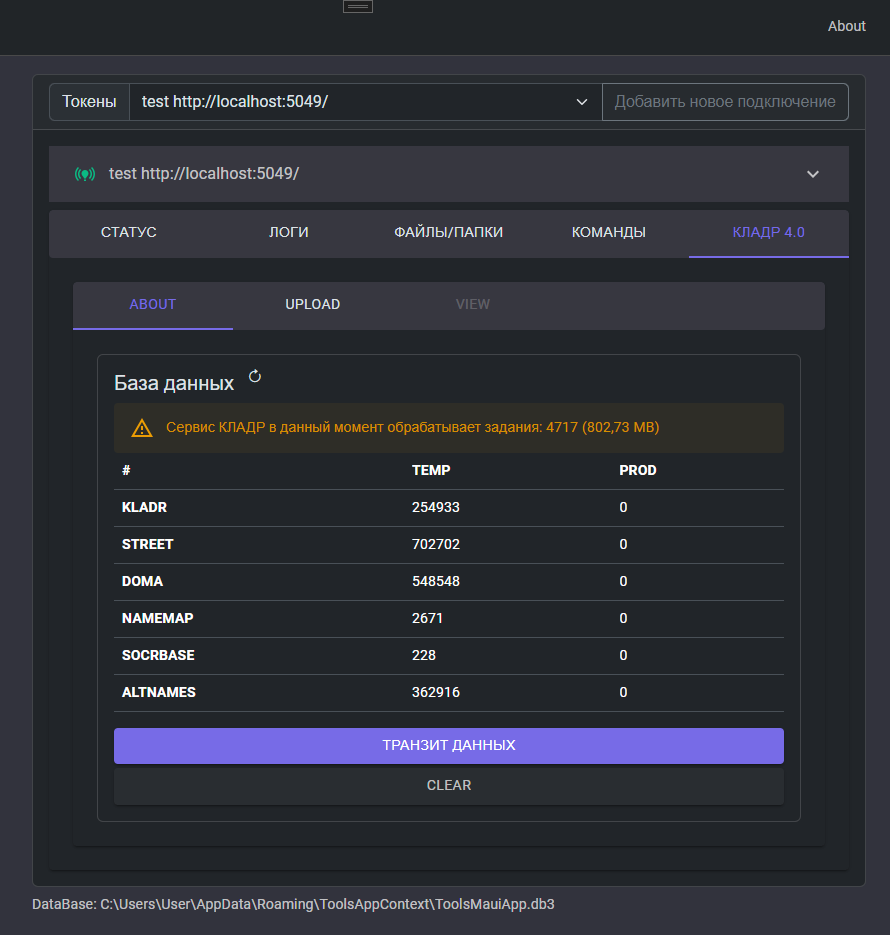

## КЛАДР 4.0

Загрузка данных и обработка сервером этих данных делается в два этапа:
- Первый этап завершается довольно быстро (за несколько минут). На первом этапе, когда пользователь нажимает кнопку "ОТПРАВИТЬ", данные не записываются сразу, а ставятся в очередь на обработку. Каждая порция данных идёт как отдельная задача, а узел (или узлы, если их несколько) обрабатывают эту очередь в меру общей производительности. 
- Второй этап может длиться довольно долго (запросто до часа). Загружается несколько миллионов строк в базу данных, что требует времени/ресурсов от сервера. Таким образом после выполнения первого этапа выгрузки данных нужно дождаться окончания обработки/записи этих данных непосредственно в БД. Мониторинг текущего состояния очереди выполнятеся благодаря штатному плагину RabbitMQ `rabbitmq_management`.

RabbitMQ - параметр `consumer_timeout = 3600000` требуется для того что бы очередь загрузки КЛАДР благополучно обработалась. Стандартных 30 минут может не хватить. Рекомендуется использовать в таких случаях 3600000 ms (=один час).
Пользователю RabbitMQ нужна TAG/роль management. Для мониторинга текущего существования/статуса задачи загрузки данных - используется rest/api RabbitMQ.