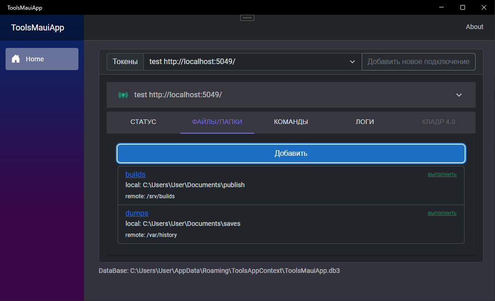
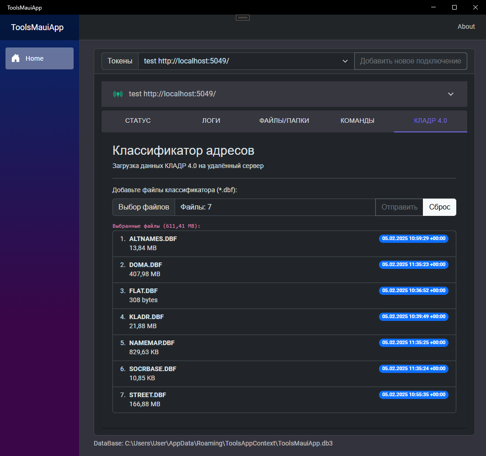

# Tools over API Rest
Утилита (win/android, а так же mac/ios) для доступа к штатному rest/api. Связь с системами минуя Web сервис и штатную Identity авторизацию. В данном случае используется токен доступа для rest/api микро-сервиса с применением [RBAC](https://ru.wikipedia.org/wiki/%D0%A3%D0%BF%D1%80%D0%B0%D0%B2%D0%BB%D0%B5%D0%BD%D0%B8%D0%B5_%D0%B4%D0%BE%D1%81%D1%82%D1%83%D0%BF%D0%BE%D0%BC_%D0%BD%D0%B0_%D0%BE%D1%81%D0%BD%D0%BE%D0%B2%D0%B5_%D1%80%D0%BE%D0%BB%D0%B5%D0%B9).

Инструмент для взаимодействия с удалённой информационной системой.

### Токены доступа

Токены прописываются в настройках подключения rest/api микро-сервиса.
Каждому токену при создании указываются персональные права доступа. `Карточка клиента` отображает имя назначенное токену и доступные ему роли/права.

### Правила синхронизации файлов/папок
Скачивание файлов, например бекапов, с удалённого сервера к себе на устройство или доставка локальных файлов на сервер. Доставлены будут только новые или изменённые файлы, а лишние будут удалены. Сверка файлов производится по имени, размеру и md5:hash файла.

Добавляйте пары папок (локальная + с удалённого сервера). В последствии по этим правилам можно производить синхронизацию данных. Синхронизация локальной папки (win/android/mac/ios) с удалённой папкой. Каждый файл отправляется отдельно (по одному за раз), а перед отправкой сжимается ZipFile (*System.IO.Compression*).

### Удалённый вызов команд (shell/cmd)
Клиент может отправлять на удалённый сервер произвольные shell команды. Команды выполняются от имени пользователя под которым запущен RestApi.

Вывод консоли

### Просмотр логов решения
С помощью api/rest доступен чтение логов.

Фильтры:
- период
- уровень важности (Level)
- имя микро-сервиса (App name)
- имя реализации типа (Logger)
- а так же имя рабочего контура (stage, prod и так далее...)

### КЛАДР 4.0
Конвертация/загрузка классификатора на удалённый сервер

Данные из официального классификатора извлекаются, конвертируются и отправляются на сервер.
В процессе загрузки данные делятся на порции и записываются в предварительное хранилище (**StorageService**). По окончанию [успешной загрузки всех порций] - данные из предварительного хранилища (**StorageService**) переносятся в место постоянного использования (**KladrService**)