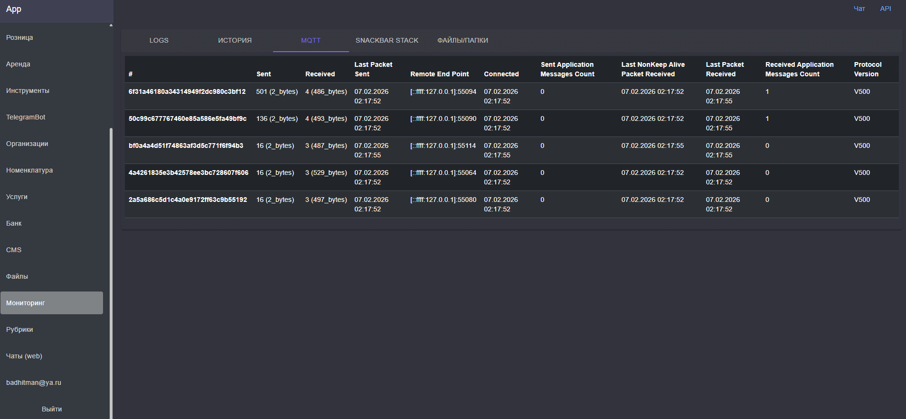
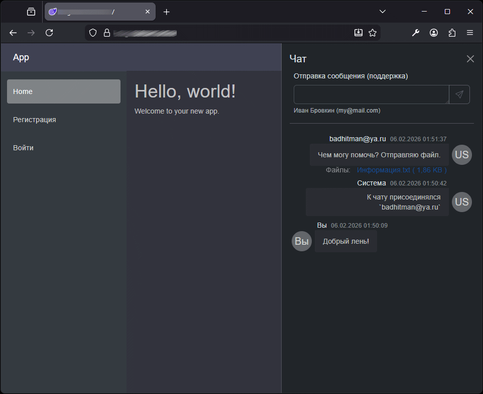
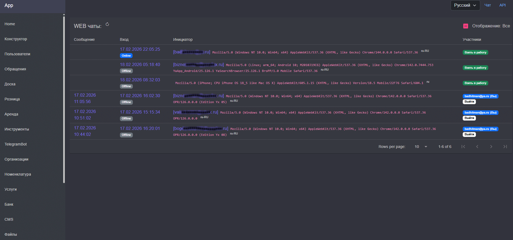
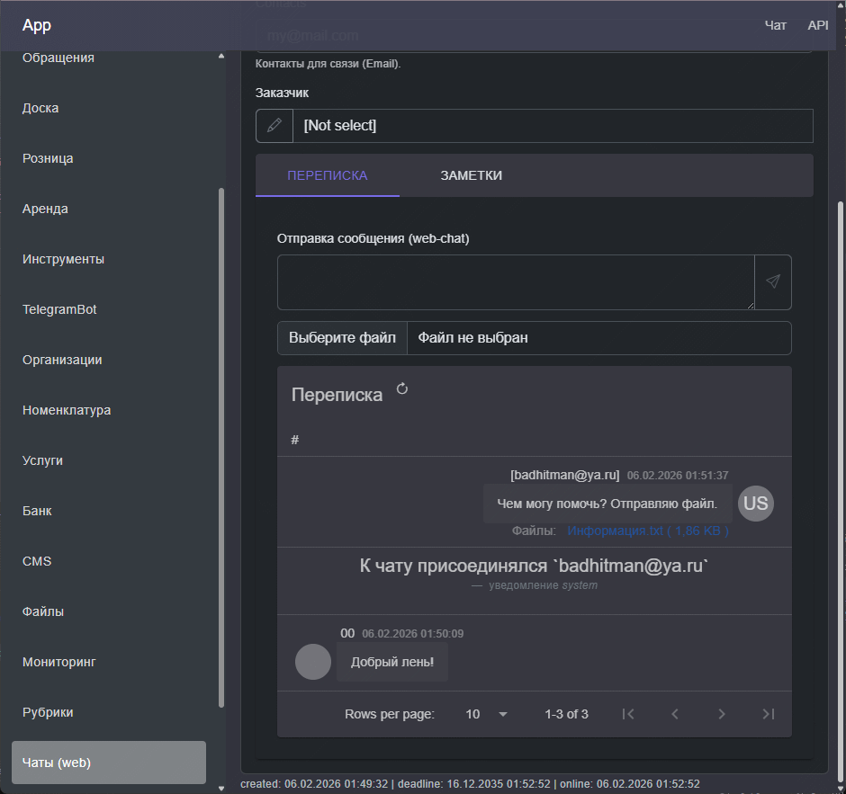

## Realtime

- MQTT сервер для организации функциональности "реального времени". Фронт-клиент подключён к MQTT, а бэк может взаимодействовать с клиентами напрямую по собственной инициативе. Бэк может отправить сообщение/команду в любой Blazor компонент.
- WebChat: чат между посетителями сайта и сотрудниками компании (служба поддержки).

